<h1> Hi, I'm Yohana <h1>

- 🔭 I’m currently working on Automotive Manufacturing
- 🌱 I’m currently learning Python & React Native
- ⚡ Fun fact: Running My Final Project for Bachelor's Degree in this year

    
    
    
    
    
    
    

## 📈 Metrics

    
    

